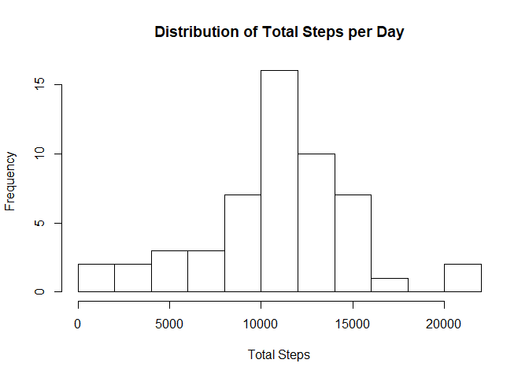
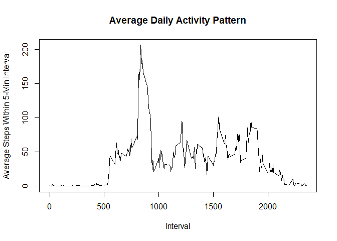
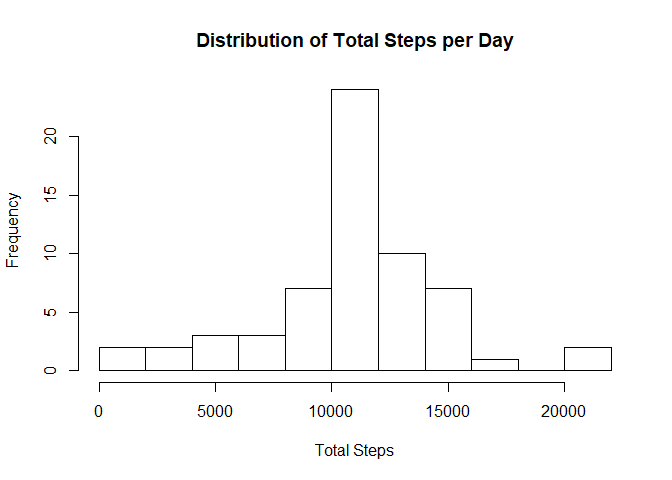
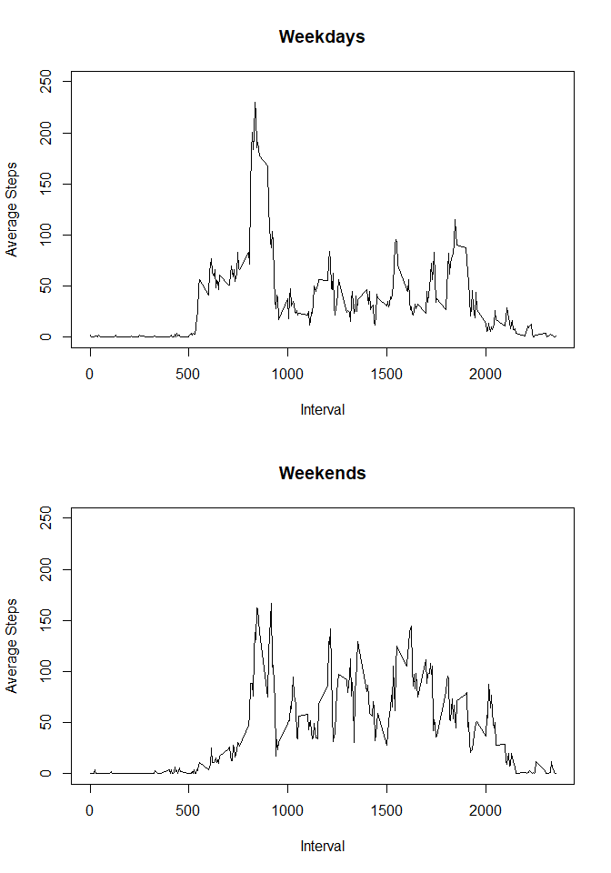

Introduction
------------

This project concerns a data set containing information about the number
of steps a person takes throughout the day.

    activity <- read.csv("activity.csv")

Distribution of Total Steps per Day
-----------------------------------

The following histogram, generated by this chunk of code, displays the
distribution of total steps per day, for the days that do not contain
missing data. It also returns the mean and median total number of steps.

    dateHist <- function(a) {
        datelist <- as.vector(unique(a$date))
        daytotals <- c()
        i <- 1
        for (d in datelist) {
            daytotals[i] <- sum(a[a$date==d,]$steps)
            i <- i + 1
        }
        hist(daytotals,xlab="Total Steps",
             main="Distribution of Total Steps per Day",breaks=10)
        
        x <- c(mean(daytotals,na.rm=TRUE),median(daytotals,na.rm=TRUE))
        names(x) <- c("mean","median")
        x
    }

    dateHist(activity)

    ##     mean   median 
    ## 10766.19 10765.00

Daily Activity Pattern
----------------------

The dataset tracks the number of steps over a set of 5-minute intervals
throughout each day. The following plot displays the way the activity
pattern changes throughout the day. Specifically, it plots the average
number of steps taken in each 5-minute interval.

    xlist <- as.vector(unique(activity$interval))
    xmeans <- c()
    j <- 1
    for (x in xlist) {
        xmeans[j] <- mean(activity[activity$interval==x,]$steps,na.rm=TRUE)
        j <- j + 1
    }
    plot(xlist,xmeans,type="l",main="Average Daily Activity Pattern",xlab="Interval",
         ylab="Average Steps Within 5-Min Interval")

We can also calculate which interval contains the highest average daily
number of steps:

    xlist[match(max(xmeans),xmeans)]

    ## [1] 835

Missing Values
--------------

    sum(is.na(activity$steps))

    ## [1] 2304

There are 2304 missing values in this data set. In fact, there are 8
days which consist entirely of NA values, 288 each, and the rest of the
days have no NA values. We can use a simple method to replace these NA
values: For each value at a particular interval, we shall simply use the
interval mean daily steps that we calculated earlier. For coherence,
we'll also round each mean to the nearest integer number of steps.

    activity2 <- activity
    for (k in 1:17568) {
        if (is.na(activity2[k,]$steps)) {
            y <- activity2[k,]$interval
            activity2[k,]$steps <- round(xmeans[match(y,xlist)])
        }
    }

Now, let's take a look at the resulting distribution of steps per day.

    dateHist(activity2)

    ##     mean   median 
    ## 10765.64 10762.00

Most of the histogram has remained the same, but one of the bins has a
noticable spike. This is unsurprising: every one of the eight "NA" days
was replaced with the exact same set of values. All eight instance of
this average of this set of values, making up an "average" day, fell
into the same bin, causing the spike.

The overall mean daily steps per day has decreased slightly due to our
rounding operation. Due to the addition of the new data, the median has
shifted as well, very slightly downwards.

Comparison of Weekdays and Weekends
-----------------------------------

Finally, let us create a panel plot highlighting the difference between
the daily activity pattern on weekdays versus weekends.

    # add weekday/weekend factor
    activity2$date <- as.POSIXct(activity2$date)
    for (m in 1:17568) {
        if (weekdays(activity2$date[m]) %in% c("Saturday","Sunday")) {
            activity2[m,4] <- "weekend"
        } else {
            activity2[m,4] <- "weekday"
        }
        
    }
    names(activity2)[4] <- "type"

    # replicate average interval steps, separating weekdays and weekends
    splitmeans <- matrix(nrow=288,ncol=2)
    n <- 1
    for (x in xlist) {
        splitmeans[n,1] <- mean(activity2[activity2$interval==x & activity2$type=="weekday",]$steps)
        splitmeans[n,2] <- mean(activity2[activity2$interval==x & activity2$type=="weekend",]$steps)
        n <- n + 1
    }

    # plot the partitioned data
    par(mfrow=c(2,1))
    plot(xlist,splitmeans[,1],type="l",main="Weekdays",xlab="Interval",
         ylab="Average Steps",ylim = c(0,250))
    plot(xlist,splitmeans[,2],type="l",main="Weekends",xlab="Interval",
         ylab="Average Steps", ylim = c(0,250))

The distributions are somewhat different. On the weekends, there is not
as much activity in the first 1000 or so interval units. However, there
is an increase in activity later in the day.
